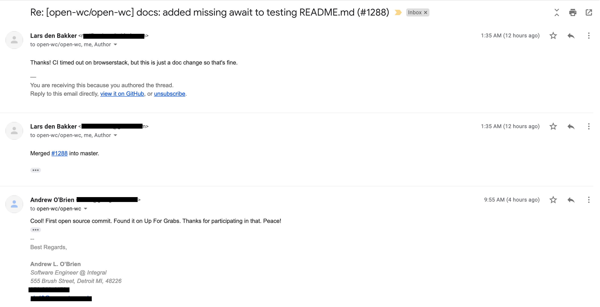
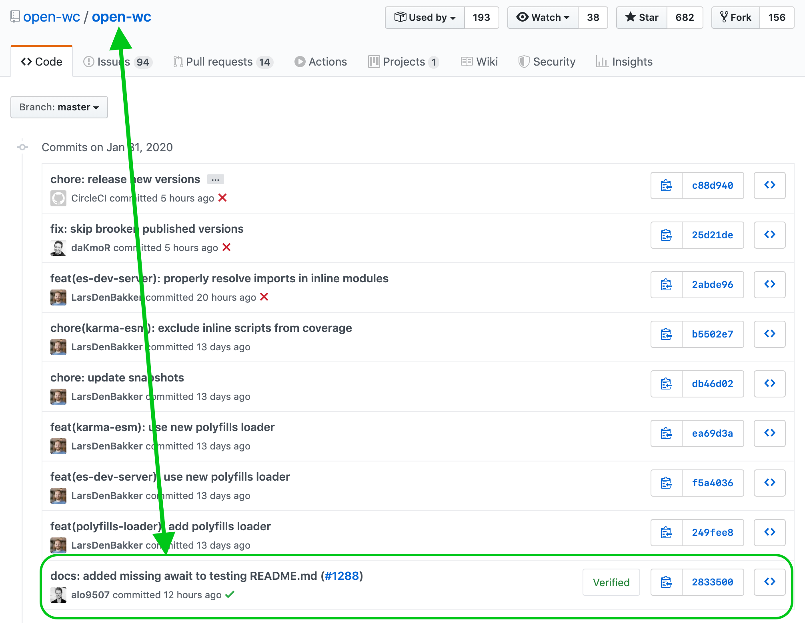

As of the writing of this article, I've been developing for 1.5 years from webdev to backend Java to mobile iOS. I voraciously consume open source packages every day of my life, benefitting enormously from the social infrastructure backing so many of my personal and professional projects.

And yet, I've never contributed code to any non-company projects.

After reading Eric Raymond's [The Cathedral and the Bazaar](https://www.amazon.com/Cathedral-Bazaar-Musings-Accidental-Revolutionary/dp/0596001088/ref=sr_1_1?crid=NDMVJQ6VR94C&keywords=cathedral+and+the+bazaar&qid=1580359078&sprefix=cathedral+and+the+ba%2Caps%2C142&sr=8-1), I felt obliged to make my first open source commit, however small, to at least get the ball rolling. Maybe it would be the start of a good habit of open source contributions.

Here's how I started, the absolute simplest way possible.

<h2><a href="https://www.firsttimersonly.com/">First Timers Only</a></h2>

After a simple Google of "easy open source contributions", I found the site above. <i>First Timers Only</i> curates a lot of helpful resources. All of the below I found on that site.

<h2>Level 0: <a href="https://github.com/firstcontributions/first-contributions">First Contributions</a></h2>

This repository is as easy as it gets to make your first risk-free, judgement-free first open source PR.

<blockquote>Your task: add your name to CONTRIBUTORS.md</blockquote>

Since you dont have write-access to this repository, you'll learn the Open Source contribution flow:

<blockquote>Fork -> Clone -> Modify -> PR forked branch to base repository</blockquote>

which differs from full write-access contribution flow you're may be familiar with from work:

<blockquote>Branch -> Modify -> PR</blockquote>

Forking rather than branching keeps the base repository from becoming cluttered with experimental branches.

Great lesson. I wanted to apply this knowledge to make a PR into a project that's actually used by other developers.

<h2>Level 1: <a href="https://up-for-grabs.net/">Up For Grabs</a></h2>

Up For Grabs curates open source projects that tag low-hanging fruit open issues with `Great First Timer`.

I filtered by `javascript` and `swift` and randomly clicked on a few projects and cheked out their open issues.

I found [open-wc](https://open-wc.org/). They're mission:

<blockquote>The goal of Open Web Components is to empower everyone with a powerful and battle-tested setup for sharing open source web components.</blockquote>

I found this [issue](https://github.com/open-wc/open-wc/issues/954) to add a missing `await` in a `README.md`.

I forked, added the `await` keyword in the docs, and PR'd my branch.

A bot commented on my PR with a red ❌ prompting me to sign the Contributor License Agreement before my contribution could be accepted.

The link brought me to a webpage called [CLA Assistant](https://cla-assistant.io/) where I could sign in with my GitHub to sign the CLA. Easy enough.

I signed and it rerouted me to the project. Now I saw the message:

`All committers have signed the CLA.`

Great. I still had one more PR blocker: [commitlint](https://github.com/conventional-changelog/commitlint). Turns out my commit message of "added missing await to testing README.md" did not abide by the projects guidelines. The error read:

`You may need to change the commit messages to comply with the repository contributing guidelines.`

I didn't know what those standards were and couldn't find them immediately, so I just looked at other commits and saw that documentation related issues were prefixed with `docs:`. That was probably it.

So I on my local I ran `git commit --amend`, prefixed my previous commit message with `docs:`, then I `git push -f`'d up to my remote branch.

This time I passed commitlint. The final check now was a code review by a maintainer.

The next morning, I received a kind comment-email from the Open Web Component project maintainer Lars den Bakker:

I replied to the email not realizing that it would comment on the repo as well. Oh well, it was kind words.

And just like that I'd officially made my [first open source contribution](https://github.com/open-wc/open-wc/pull/1288):

<h2>Level 2: On My Own</h2>

[in progress]

(find a project issue that requires actual coding)

<h2>Lessons Learned</h2>

I can't truly call myself an open source contributor yet, but the seal has been broken.

I learned:

- Forking prevents clutter and allows maximum access to auxiliary repos without adding contributors to main repo
- OSS requires stricter communication standards than a work environment
- Contributor License Agreements are often necessary before contributing
- It's not great to have auto-formatting on when you're working on OSS. Auto-formatting on save

I didn't realize how often in the office I rely on proximity to facilitate communication. That's an impossibility in OSS and a lot of their strict standards could serve office environments well.

I think it would be cool to give several hours each month to your team to heavily encourage your developers to search for an open source project to contribute to. ANY Open Source project.

Don't wait to contribute to OSS. The medium is the message. The content of your first commit is secondary to cracking the seal on giving back to an ecosystem and social economy that has given the world so much.
