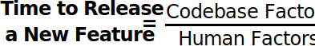
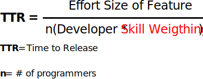

<blockquote>Enterprise asks of pair programming culture: why would I pay two developers to do the job of one?</blockquote>

This legitimate concern with pairing stems from the following notion about the nature of software release time:

Where number of programmers is taken to mean <i>independently operating</i> programmers. The argument goes that if two programmers are coalesced onto a single task, then the time to release will lengthen.

But this is <b>not</b> even close to a comprehensive Time-to-Release (TTR) equation. The truth, as usual, is much more subtle.

Let's progressively introduce complexities to the TTR equation untl we arrive at a more realistic notion of what factors effect time to release.

Once we've arrived at a more thorough (though unavoidably imperfect) TTR equation, we'll examine what human and codebase factors are effected positively and negatively by pair programming.

<h2>Codebase Divided by Humans</h2>

Before we get started adding complexities to the TTR equation, let's first observe the fact that one level of abstraction higher than the equation above, we arrive at:

The more complex, or "larger" the codebase factor, the higher the TTR.

The more maximized the human factor in terms of skill, the lower the TTR.

With this in mind, let's go through those factors one by one. There are 8 of them.

<h2>Technical Ability of Programmers</h2>

<blockquote>Quote here</blockquote>

Not all programmers are of equal technical skill. Software development is nothing more than hundreds of small decisions every day. Experienced devs make better decisions quicker.

Thus:

The greater the technical ability, the fewer devs <i><b>n</b></i> necessary to achieve the same Time to Release, <b>TTR</b>.

The mythical 10x engineer fits in here as a major factor, with a massive skill weighting.

This one's obvious, so we won't belabor it.

<h2>Code Reuse</h2>

<blockquote>Good devs code well, great devs know how to lift, adapt and integrate existing code into the new project.</blockquote>

Most codebases are not ex nihilo. The decision to buy or build should be made in light of <i><b>net value of reusable code</b></i>, where

Net Value of reusable code = Effort to custom build - integration cost of existing code

If it takes more time and energy to integrate existing code than it would be to build from scratch, the net value becomes negative and lengthens TTR rather than shortening it.

Thus:

<h2>Codebase Size</h2>

<blockquote>Quote here</blockquote>

As the codebase grows in size, the possibility for regressions caused by new features grows.

This is why greenfield projects often see massive velocity early on: there are fewer constraints on each user story.

<h2>Codebase Quality</h2>

<blockquote>The greater the quality of a codebase, the less effect codebase size will have on time-to-release</blockquote>

Quality is a combination of both human and performance factors, including properly deployed architectural patterns, naming consistency, performance and documentation.

Good architecture and documentations allow codebases to grow in size without increasing in complexity. New features fit snugly into existing paradigms rather than being solved in an ad hoc “take it as it comes” manner that leads to gross interdependencies and spaghetti code.

We reflect this by dividing codebase size by codebase quality, since quality offsets the negative effects of size. Even a monorepo as massive as Google's may not effect TTR if the quality is such that the place to add new modules is obvious and not interdependent.

<h2>Codebase Familiarity</h2>

<blockquote>Quote here</blockquote>

Familiarity with codebase here encapsulates:

- <b>Tribal knowledge</b>: “I remember what we named that method - let me just search for it”
- <b>Architectural knowledge</b>: “How should I implement this new screen with navigation and networking. I should use the precedent set by the Coordinator pattern and Repository pattern.”

Codebase familiarity is the ability to reach for precedent in existing code rather than solving the problem for the first time.

Codebase familiarity lets you solve problems once and use that answer everywhere.

Even a great dev in uncharted territory may perform a slower than a less skilled dev familiar with the ley of this land, however idiosyncratic it may be.

A feature can be added to even the most inconsistent and undisciplined codebase if a programmer if familair with the quirks from weeks in the trenches.

I think familiarity isn't quite as valuable as technical skill, so we add it rather than multiply it.

<h2>Upskilling Opportunities during Project</h2>

<blockquote>You are not the same developer towards the end of a project as you were at the beginning. Programmer skill is dynamic across time and grows logarithmically in a step-wise fashion proportional to the quantity and diversity of upskilling opportunitites presented to developers during a project.</blockquote>

Many projects are marathons, not sprints, and during that marathon novice and intermediate developers can really rise to the occasion. Programmer ability towards the end of the project is always greater than it was at the beginning.

Why do I say tehcnical skill improves logarithmically? Because revelations level-off to new palteaus. An initial boost levels off to a new norm.

Why step-wise? Becuase revelations by definition only come once in a while, and they take time to sink in. An "aha!" moment paired with practice is what lifts a developer to the next level.

I’ve had certain revelations in my career that have massively improved my productivity. Here’s a graph of what this year has looked like:

So we should multiply the skill weighting of an individual programmer to reflect this reality of change over time.

Where upskilling time is a rough estimate of how deep into the projet we are and how many upskilling opportunitites have been presented to the developer.

It’s the job of a good team leader, particularly a technical one, to figure out what plateaus people are in, what revelations are needed to break out of those plateaus, and how to deliver them. This greatly effects feature TTR.

This is where the 10x Engineer’s cool cousin, the Team Multiplier Engineer, acts as a major scaling factor. Some devs just teach really well. They care that others know what they know. They multiply the lesser abilities of other devs on the team with their positivity, kindness, and knack for succinct and comprehensible explanations of complex subject.

<h2>The Time to Release Equation</h2>

Endlessly debatable, but here’s what I take to be a more realistic equation for determing time to release a new feature:

A powerful symmetry emerges. The top half of the equation is all technical factors. The bottom half of the equation is all human factors.

The lead Software Engineer is responsible for minimizing the top half of this equation, i.e. the codebase half.

The Product Manager is responsible for maximizing the bottom half of this equation, i.e. the human half.

Let's now answer the original question:

<blockquote><b>QUESTION</b>: How does pair programming effect time to release?</blockquote>

I attempt an answer to this question in Part II: [How Pair Programming Effects TTR](/pair-programming-answer/)
