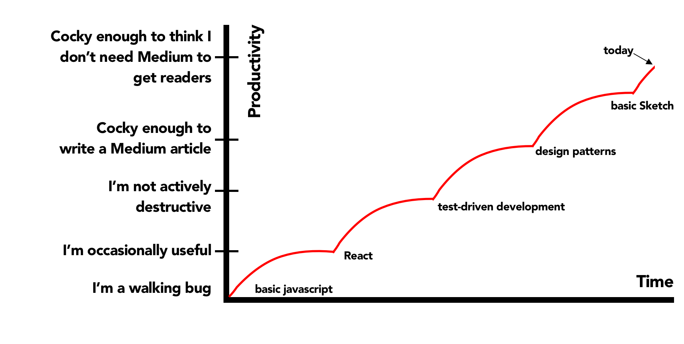

<blockquote>"Why would I pay two programmers to do the job of one?"</blockquote>

Enterprises ask of pair programming culture: why would I pay two developers to do the job of one?

This perplexity with pairing reflects the following notion about the nature of software development:

Time to Develop New Feature = Effort Size of New Feature / # of Programmers

Where number of programmers is taken to mean independently operating programmers. The argument goes that if two programmers are coalesced into one, then the software development time grows.

But this is <b>not</b> the equation of software development time. The truth, as usual, is much more subtle.

This article will be devoted to breaking down the operators on the right side of this equation: The human factor in the numerator. The codebase factor in the denominator.

We'll progressively introduce complexities untl we arrive at a more realistic notion of the cost of software development.

Finally, we'll look at how pairing effects the human / codebase, top and bottom halves of the equation.

As we introduce each new factor, we'll abbreviate it thereafter fro formatting reasons.

<h2>Complexity 1: Technical Ability of Programmers</h2>
Not all programmers are of equal technical skills. Better devs spend less time researching and more time cutting the throat of the project.

Thus:

The greater the skill, the fewer devs necessary to achieve the same TTD.

The mythical 10x engineer fits in here as one part of the equation, with a massive skill weighting.

This one's obvious, so we won't belabor it.

<h2>Complexity 2: Pre-existing Code</h2>

<blockquote>Good devs code well, great devs know how to lift adapt and integrate existing code into the new project. </blockquote>

Most codebases are not ex nihilo.

Thus:

Time to Develop New Feature = Effort Size of New Feature - Existing Code / # of Programmers

Where Value of reusable code = Time to custom build from scratch - integration cost of reusable code

<h2>Size of Codebase</h2>

As the codebase grows in size the possibility for regressions caused by new features grows.

<h2>Quality of Codebase</h2>

Quality is a combination of architecture, consistency and and comprehensibility (think documentation).

With good architecture, codebase growth in size carries with it a smaller increase in complexity, as new features fit snugly into existing paradigms rather than being solved in an ad hoc “take it as it comes” manner that leads to gross interdependencies. Good architecture scales, thus we set it as a divisor to size of codebase to indicate the better the architecture and code hygiene, the less of an impact codebase size will have on time to develop a new feature.

<h2>Familiarity with Codebase</h2>

Familiarity with codebase here encapsulates:
Tribal knowledge: “I remember what we named that method - let me just search for it”
Architectural knowledge: “How should I implement this new screen with navigation and networking. I should use the precedent set by the Coordinator pattern and Repository pattern.”

Even a great dev in uncharted territory may perform a slower than a less skilled dev familiar with the ley of this land, however idiosyncratic it may be.

<h2>Upskilling Opportunities during Project</h2>

<blockquote>You are not the same developer towards the end of a project as you were at the beginning</blockquote>

<blockquote>Programmer skill is dynamic across time and grows logarithmically with the number and diversity of upskilling opportunitites presented to them.</blockquote>

Why logarithmically? Becuase progression comes stepwise. An initial boost levels off to a new norm. Here's an example from my own life:

So we should adjust the skill weighting of an individual programmer to reflect this time and upskilling opportunity factor.

Many projects are marathons, not sprints, and during that marathon people can really rise to the occasion, progressing from novice to expert. Programmer ability towards the end of the project is greater than it was at the beginning. This upskilling across time is a factor in

This may be bundled with technical ability, but in reality it is a factor playing into net technical ability.

Time to Develop a New Feature = (Size of project - Pre-exisiting code) / # of (programmer \* skill multiplier)

Skill does not increase at a linear rate over time. It’s more like a stepwise logarithmic function.

There are plateaus in progression, so a complete novice will go from effectively useless to productive in a month, reflecting a major increase in their contribution to TTD. People who are already experts may improve in familiarity quickly, but without much increase in their technical ability.

I’ve had certain revelations in my career that have massively improved my productivity. Here’s a graph of that.

It’s the job of a good team leader, particularly a technical one, to figure out what plateaus people are in, what revelations are needed to break out of those plateaus, and how to deliver them. This effects time to develop features greatly.

(If initial skill is low, time has a greater effect. How to reflect mathematically?)

Technical Ability Multiplier = (Initial Technical Ability / Overall Improvement) \* Time

Improvement decay = Technical Ability

That’s why we have so many bootcamps: a small amount of requisite skill is all that’s necessary to be menially productive in the software development workforce.

When devs say “At first I was learning so much on the project, but know it’s just the same thing everyday,” this improvement decay is partially what they’re referring to.

This is where the 10x Engineer’s cool cousin, the Team Multiplier Engineer, acts as a scaling factor. Some devs just teach really well. They care that others know what they know. They multiply the lesser abilities of other devs on the team with their positivity, openness, and teaching.

The deeper into the project we go, the better the devs get, the greater the acceleration, but also the larger the codebase. The negative effect of codebase size is balanced by familiarity with the codebase

The Equation

Endlessly debatable, but here’s what we’ve arrived at.

Time to Develop = Size of codebase \* (Productive Hours + Unproductive Hours / Programmers) - Pre-exisiting code)

Footnote:
A powerful symmetry emerges.

<blockquote>QUESTION: What is pair programming?</blockquote>
<blockquote>ANSWER: A tool with the potential to maximize the bottom (human) part of the software development equation</blockquote>

The Product Manager is responsible for maximizing the top half of this equation, i.e. the human half.

The lead Software Engineer is responsible for minimizing the top half of this equation, i.e. the codebase half.

The product manager can foster team maximization with proper pair rotations, managing who is assigned to what stories in the backlog, and pair rotations.

The tech anchor can foster this through lunch and learns, documentation, good architecture from the start, proper PR reviews.

NOTICE! n is just one small factor amidst so many others. (arrow pointing to n)

Now that we have an okay more complex view of the factors effecting Feature TTD, lets see which operators are positively and negatively effected by pair programming.

Pair Programming and Time To Delivery

The Operands of the Development Equation positively impacted by Pairing:
Training multiplier:
Pair programming makes knowledge transfer and onboarding a near inevitability.
Breadth-first familiarity with the entire codebase with good pairing rotations
Proper rotations provide

The Operands of the Development Equation negatively impacted by Pairing:
Raw skilled programmer hours devoted to the codebase
In a pair programming environment, it is a fact that some of your most senior devs will end up pairing with junior developers. Assuming the senior dev doesn’t just stone wall the junior and fly on the keyboard solo, some of that developers time will go towards talking rather than typing.
Depth-first specialization and familiarity in certain parts of the codebase
This can make some devs incredibly fast at implementing features in one part of the codebase, but much slower in others.
This can of course be offset with user story rotations, but it’s still one mind that created that feature solo.

The Only Thing that Matters: Who Wins this Debate?

Just kidding.

Some devs like pairing all the time. Some like pairing most of the time. Some like pairing less of the time. Some don’t like pairing at all.

They are all correct.

I happen to be a social dev. My entire career except for a few months has been spent pairing. I prefer rabbit holing with my headphones in for hours, getting lunch, then popping out and sharing what I made in a good pairing session. To facilitate this, my personal preferred work routine would be 3 days pairing and 2 days solo coding, to be decided by me and my pair in our iteration planning meeting.
