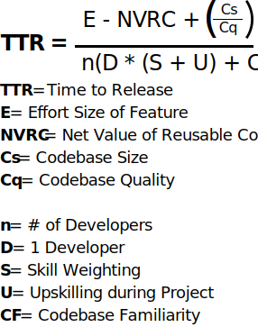

<i>This is Part II of Pair Programming in the The Race to Release.</i>

Read [Part I](/pair-programmaing-in-the-race-to-release/) first for full effect.

<h2>Pair Programming and Time To Release</h2>

Here's the equation we arrived at in Part I:

We asked the questions:

<blockquote>Why would I pay two developers to do the job of one?</blockquote>

and

<blockquote>How does pair programming effect time to release?</blockquote>

Here we venture an answer:

<blockquote>Pairing has the potential to directly MAXIMIZE the bottom human part of the TTR equation, resulting in second order consequences that MINIMIZE the top codebase half of the TTR equation.</blockquote>

Let's examine how pairing effects

<h2>Pair Programming is like an Open Source Microchosm</h2>

I see some parallels between the value of pair programming and the value of open source.

Pair programming is like a microchosm of open source development.

Eric Raymond's classic The Cathedral and the Bazaar

"Given enough eyeballs, all bugs are shallow"

"Somebody finds the problem, and somebody else understands it."

This is where codebase familiarity meets developer skill.

For example: Enter a senior developer onto a new project. The juniors are oh-so familiar with all the quirks of the codebase, they just don't know how to fix them. In my experience this leads to some of the most productive pairing sessions there can be, as the juniors explain the problem they've been facing, problems which the new senior could not have known from lack of codebase familiarity.

<h2>Ample Upskilling Opportuntiies</h2>

Pairing provides upskilling opportunities every minute of every day. Pair programming makes knowledge transfer and onboarding a near inevitability.

Lasting lessons require a degree of suffering. When confronting a difficult technical challenge, the solo developer bears that suffering alone. In a pair programming environment, that lasting lessons sits with both developers as they co-construct a soltuion and remember the lesson for later use.

Many developers value on-the-job professional development opportunities very highly. This makes companies with pair programming cultures highly attractive to both junior developers as well as intermediate or senior developers entering a new software engineering discipline. Certain breeds of senior devs of course enjoy pairing with other senior devs as well.

<h3>Talking rather than typing</h3>

The raw hours that developers with high skill weightings spend actually coding in a healthy pair programming culture is by necesssity less than it would be otherwise. Some time is diverted away from coding and devoted to explaining what they're doing and why they're doing it to other developers.

Some time will be spent talking rather than typing.

<h3>Pair programming changes how you hire</h3>
This is not bad in itself, but it may exclude certain anti-social or even misanthropic geniuses with very high individual skill weightings from joining you organization. 10x Engineers glow on the surface, but they have [one unfortunate characteristic](/the-problem-with-10x-engineers/) that could crush your product.

Though a healthy pairing culture may preclude the hiring of a certain breed of irascible genius 10x Engineers, it is still the best way to provide literally constant upskilling opportunities to all developers on the project.

<h2>Breadth-first Codebase Familiarity</h2>

Devs talk shop. The conversations that take place organically during pairing and exploring the codebase lead to a healthy breadth-first familiarity with the entire codebase with good pairing rotations.

However, this means developers may be slightly less specialized. Both a blessing and a curse, depth-first specialization and familiarity in certain parts of the codebase can boost developer efficiency for tasks in those areas. Without pair rotations, it often happens that one developer develops a deep familiarity, a kind of intellectual marriage, to one part of the codebase that they solo-coded at some point. Other developers begin avoiding that area, happy to just let the original author handle any issue that arises in their personal enclave of the codebase.

This kind of specialization is efficient but dangerous. It is efficient in the short term to just let Dr. I-Wrote-this-Code whip out bug fixes, but in the mid to long term, this often causes idiosyncratic, ad hoc and quirky code. Isolation breeds individuality, and in a codebase individuality is really quirks. A quirky codebase is the last thing you want.

This can of course be offset with intentional user story rotations.

<h2>The Only Thing that Matters: Who Wins this Debate?</h2>

Just kidding.

Some devs like pairing all the time. Some like pairing most of the time. Some like pairing less of the time. Some don’t like pairing at all.

They are all correct.

I happen to be a social dev. My entire career except for a few months has been within pair programming cultures. I prefer rabbit holing with my headphones on for hours, getting lunch, then popping out and sharing what I made in a good pairing session. My personal preferred work routine would be 3 days pairing and 2 days solo coding, to be decided by me and my pair in our iteration planning meeting.

That's all! LMK what your take is on pairing in the comments, and any additional factors I missed in the Time-to-Release Equation. Everything on here is a living document.

(wondering about project halo idea for getting fresh set of eyes)
