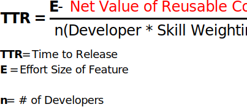

<blockquote>Enterprise asks of pair programming culture: why would I pay two developers to do the job of one?</blockquote>

This legitimate concern with pairing stems from the following notion about the nature of software feature release time:

Where number of developers is taken to mean <i>developers operating in parllel</i>. If this equation were all there is to determing <b>Time-to-Release (TTR)</b> a new feature, then combining the efforts of two developers onto a single task should effectively <i>double</i> the time it takes to complete two features compared to if those developers were working in parallel, right?

But this is not what we see in practice.

Frederick Brooks states the misconception eloquently in his classic software engineering anthology, [The Mythical Man-Month](https://www.amazon.com/Mythical-Man-Month-Software-Engineering-Anniversary/dp/0201835959/ref=sr_1_1?crid=3O2L8PDSPQDPI&keywords=the+mythical+man+month&qid=1580174025&sprefix=the+mythical+man+m%2Caps%2C140&sr=8-1):

<blockquote>...our estimating techniques fallaciously confuse effort with progress, hiding the assumption that [people] and months are interchangable</blockquote>

To see how the reality diverges from the above oversimplification, this article will first formulate a more realistic TTR Equation by adding other factors one by one. The following article, [Pair Programming and The Race to Release Part II](/race-to-release-part-2), will demonstrate which factors of the TTR equation may be effected by pair programming culture.

This two-part series attempts to formulate a more full-fledged TTR equation in Part I, then show how pairing effects TTR in Part II.

Our TTR equation will operate under the <i>ceteris paribus</i> assumption. We hold all other factors outside of software engineers, their skill and their interactions with each other as equal.

<h2>Codebase Divided by Humans</h2>

Before we get started adding more factors to the TTR equation, let's first observe the fact that one level of abstraction higher than the equation above, we arrive at:

The more complex the codebase factor, the higher the TTR.

The more maximized the human factor, the lower the TTR.

With this in mind, let's propose several codebase and human factors one by one.

<h2>Technical Ability of Programmers</h2>

Not all programmers are of equal technical skill. Software development is nothing more than hundreds of small decisions every day. Experienced devs make better decisions quicker.

This skill difference can be reflected as each developer's skill-weighting:

The greater the technical ability, the fewer developers <i><b>n</b></i> necessary to achieve the same TTR.

The mythical 10x engineer fits in here as a major factor, with a massive skill weighting.

<h2>Code Reuse</h2>

Good devs code well, but great devs know how to lift, adapt and integrate existing code into a new feature.

Reusable code can be integrated from one of two places:

- <b>1st Party</b>: This is code that is either already in the codebase solving a similar but not identical problem, or some other part of your organization
   
  <i class="example">Examples: Reusable UI Components, services</i>

- <b>3rd Party</b>: SaaS and open-source packages

The decision to build from scratch versus integrating reusable code should be made in light of the estimated <i>net value of reusable code</i> (NVRC), where NVRC is:

Net Value of Reusable Code = Custom Build Effort - Integration Effort

If it takes more time and energy to integrate existing code than it would be to build from scratch, the net value becomes negative and lengthens TTR rather than shortening it, even though it is "pre built".

Let's subtract the net value of reusable code from the raw effort size of the feature.

<h2>Codebase Size Divided By Codebase Quality</h2>

<blockquote>Proper architecture allows codebases to grow in size without increasing in complexity.</blockquote>

As the codebase grows in size, the possibility for regressions caused by new features grows.

This is why greenfield projects often enjoy very high velocity early on: there are fewer constraints on each user story.

Though it's certainly a factor in TTR, Codebase Size cannot be considered as a TTR factor in isolation. What if the codebase were 1 million lines, but thanks to proper modularization, the new feature could effectively ignore all but a single integration point in that codebase?

The correlation between codebase size and TTR is meaningless without also considering Codebase Quality.

The greater the quality of a codebase, the less effect codebase size should have on TTR.

"Codebase quality" is intentionally vague, including everything from properly employed architectural patterns to naming consistency to documentation.

New features fit snugly into existing paradigms rather than being solved in an ad hoc “take it as it comes” manner that leads to gross interdependencies and spaghetti code, both of which drastically increase TTR.

Even in a monorepo as massive as [Google's](https://cacm.acm.org/magazines/2016/7/204032-why-google-stores-billions-of-lines-of-code-in-a-single-repository/fulltext), codebase size may not effect TTR significantly if the codebase quality is such that the place to add new modules is obvious and not interdependent.

We reflect this by dividing codebase size by codebase quality, since quality offsets the negative effects of size. This quotient is added to the raw effort size of the feature:

<h2>Codebase Familiarity</h2>

Codebase familiarity is a human factor which encapsulates:

- <b>Tribal knowledge</b>: Tribal knowledge is peer-to-peer transmitted know-how which is non-obvious to out-memberso of a group. It is knowledge which is known yet undocumented. 
  <i class="example">Example: “I remember what we named that method we need - let me just search for it”</i>
- <b>Architectural knowledge</b>:
   
  <i class="example">Example: “How should I implement navigation to this new screen? I should use the precedent set by the Coordinator pattern!”</i>

Codebase familiarity is the ability to reach for precedent in existing code rather than solving the problem for the first time.

Engineers with high codebase familiarity feel like they're walking into a toolshed they organized themselves. Only in codebases the analogy goes even further - because the engineer also built the tools.

Even a great developer in uncharted territory may perform slower than a less skilled dev familiar with the ley of this land, however idiosyncratic it may be.

Codebase familiarity arises from an interplay between the developer's experience and memory, and the degree of code discoverability in the codebase. Some codebases are just, well, easier to become familiar with.

I think familiarity isn't quite as valuable as technical skill, so we add it rather than multiply it by the individual developer.

<h2>Upskilling Opportunities during Project</h2>

You are not the same developer at the end of a project as you were at the beginning.

I believe that skill development for software engineers does not grow linearly. Instead, it grows in a <i>step-wise</i> fashion. When a new concept is realized, be it from a mentor or a blog article, a developer's productivity may inrease dramatically in a short period of time. Hence the step-wise nature.

It takes some time for new concepts to sink into a programmer's arsenal. These step-wise boosts level off asymptotically to new norms, and a new conceptual kick is needed.

I believe the degree of developer growth is proportional to the quantity and diversity of upskilling opportunitites presented to developers during a project.

Here's a graph of my own step-wise, asymptotic leaps over this past year:

Let's add Upskilling during Project to our Skill Weighting to reflect the increase in skill programmers ought to undergo on a well managed projects

Upskilling during Project is where the 10x Engineer’s cool cousin, the Team Multiplier Engineer, acts as a major scaling factor.

<blockquote>A Team Multiplier Engineer is an individual who maximizes the effectiveness of existing team resources</blockquote>

Some devs just teach really well. They care that others know what they know. They multiply the lesser abilities of other engineers on the team with their positivity, kindness, and knack for succinct and comprehensible explanations of complex subject. Keep them around at all costs.

<h2>A More Realistic Time to Release Equation</h2>

<i>More realistic, though hardly exhaustive.</i>

Endlessly debatable, but here’s what I take to be a more realistic equation for determing time to release a new feature:

The lead Software Engineer is responsible for minimizing the top half of this equation, i.e. the codebase half. They achieve this by increasing code quality, properly determining when to employ reusable code.

Both the Product Manager and the lead Software Engineer together are responsible for maximizing the bottom half of this equation, i.e. the human half. They can do this by facilitating knowledge shares on the project and properly onboarding new hires.

Ideally, a partnership exists between the PM and Lead Software Engineer to jointly minimize TTR by singling out and increasing/decreasing the factors we outlined above.

<h2>Time for Part II: Pair Programming</h2>

Let's now return to the original question:

<blockquote><b>QUESTION</b>: How does pair programming effect time to release?</blockquote>

With our TTR equation in tow, let's attempt to answer this question in Part II: [How Pair Programming Effects TTR](/race-to-release-part-2/).c
