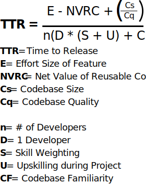

<i>NOTE: This is Part II of the two-part series, Pair Programming in the The Race to Release. Read [Part I](/race-to-release-part-1/) before diving in here for full context.</i>

Here's the Time to Release (TTR) equation we arrived at in [Part I](/race-to-release-part-1/):

Acting as a hiring manager, we posed the question:

<blockquote>Why would I pay two developers to work on the same task simultaneously?</blockquote>

We're now conceptually equipped to venture an answer:

<blockquote>Pair programming encourages a net mid- and long-term maximization of the bottom, human part of the TTR equation.</blockquote>

Here, in no particular order, is how I've seen pair programming push and pull on several TTR factors.

<h2>Given enough eyeballs, all bugs are shallow</h2>

The above quote is from Eric Raymond's classic on the history and economy of Open Source culture, [The Cathedral and the Bazaar](https://www.amazon.com/Cathedral-Bazaar-Musings-Accidental-Revolutionary/dp/0596001088/ref=sr_1_1?crid=1CFR5N69R28KX&keywords=the+cathedral+and+the+bazaar&qid=1581131944&sprefix=the+cathedral+and+the+ba%2Caps%2C141&sr=8-1).

I see parallels between pair programming and the mindshare crowdsourcing economy that has driven the success of open source software since the sixties.

Over decades working on open source projects, Raymond observed that bugs were quickly fixed when "somebody finds [the] problem, and somebody else understands [the problem]."

Pair programming is like a microchosm of open source development.

Pair programming allows one developer's codebase familiarity to complement another developer's skill.

EXAMPLE: Enter a senior developer onto a new project. The juniors are oh-so familiar with all the quirks of the codebase, they just don't know how to fix them. The juniors explain the problem they've been facing, problems which the new senior could not have known from lack of codebase familiarity. The seniors propose and guide implementations of their solution.

<h2>Preventing Silos</h2>

Pair programming makes knowledge transfer and onboarding a near inevitability. It also short circuits what I call the <i>Silo Cycle</i>.

Here's some on the ground social dynamics that management may not know exists if all they see is a backlog chugging along.

The Silo Cycle looks like this:

- The 10x Engineer knows how to fix it

- The 10x Engineer might as well just do it

- The 10X Engineer fixes it. Return to Step 1

The Silo Cycle is a factory churning out 10x Engineers that can breathe life into, but who later suffocate products.

In the classic [The Psychology of Computer Programming](https://www.amazon.com/s?k=the+psychology+of+computer+programming&crid=1UJ6Q3B06AUYV&sprefix=the+psychology+of+computer%2Caps%2C156&ref=nb_sb_ss_i_1_26), Weinberg identifies team interaction as the primary mechanism for ensuring team longevity:

<blockquote>"...in a programming team, we sometimes see the survival of the team when not a single original member remains...This ability comes, of course, from the interaction among team members, because the interaction permits the goals and accomplishments of the team to be transmitted to new members and so remain when old members depart...Many project managers are unable to grasp this view of a project. Their view of the probject's structure is, instead, much like that of a house - a structure that might collapse should one of the beams be removed"</blockquote>

Replace "one of the beams" with "10x engineer", and the point becomes immediately clear.

Proper pair programming culture increases your [bus factor](https://en.wikipedia.org/wiki/Bus_factor).

<h2>Ample Upskilling Opportunities</h2>

Pairing provides upskilling opportunities every minute of every day.

Lasting lessons require a degree of suffering. When confronting a difficult technical challenge, the solo developer bears that suffering alone. In a pair programming environment, that lasting lessons sits with both developers as they co-construct a soltuion and remember the lesson.

Many developers value on-the-job professional development opportunities very highly. This makes companies with pair programming cultures highly attractive to both junior developers as well as intermediate or senior developers entering a new software engineering discipline.

<h3>Talking rather than typing</h3>

Notice that I said pair programming can lead to "net mid- and long-term increase in the bottom, human part of the TTR equation." The keywords here are <b>net</b> and <b>mid- to long-term</b>.

In the short term, you're best to just condense the salaries of two junior developers into one 10x senior and let them rip.

The raw hours that developers with high skill weightings spend actually coding in a healthy pair programming culture is by necesssity less than it would be otherwise. Some time is diverted away from coding and devoted to explaining what they're doing and why they're doing it to other developers.

Some time will be spent talking rather than typing.

<h3>Pair programming changes how you hire</h3>

This is not bad in itself, but it may exclude certain anti-social or even misanthropic geniuses with very high individual skill weightings from joining your organization.

10x Engineers glow on the surface, but if they leave, they could take your product's success with them.

Though a healthy pairing culture may preclude the hiring of a certain breed of irascible genius 10x Engineers, it is still the best way to provide literally constant upskilling opportunities to all developers on the project.

<h2>A thousand little experiments</h2>

Major positive architectural changes begin with quickly spiked experiments that require a rabbit hole. Developers fear that pair programming prevents them from executing on these experiments because they need to get the buy-in of their pair to execute on them.

Many developers dislike pair programming. Many developers who have paired have not paired in a disciplined way.

They were served burnt pizza and now they've decided they don't like pizza.

Proper pairing methodology should allow every developer to complete their thought and run their experiment without interruption. This methodology, [Mobbing RPG](https://github.com/willemlarsen/mobprogrammingrpg), is the best one I've found yet for enabling experimentation. It divides roles into [Navigator](https://github.com/willemlarsen/mobprogrammingrpg/blob/master/theNavigator.pdf), [Driver](https://github.com/willemlarsen/mobprogrammingrpg/blob/master/theDriver.pdf), and [Archivist](https://github.com/willemlarsen/mobprogrammingrpg/blob/master/theArchivist.pdf).

The above roles paired with a simple desktop turn-taking tool with adjustable pair-switching durations like [Mobster](https://github.com/dillonkearns/mobster) helps mitigate the rude effects of one pair disturbing another pairs experimentation flow.

<h2>The hard thing about building software is deciding what to say - not saying it.</h2>

The above quote is from Frederick Brooks's [No Silver Bullet](http://worrydream.com/refs/Brooks-NoSilverBullet.pdf).

Other group-programming configurations have been proposed besides one-on-one pair programming. One notable example is Frederick Brook's metaphor of a Surgical Team which he proposes in [The Mythical Man Month](https://www.amazon.com/Mythical-Man-Month-Software-Engineering-Anniversary/dp/0201835959/ref=sr_1_1?crid=O75FGAVRA4RP&keywords=the+mythical+man+month&qid=1581379436&sprefix=the+mythical+man%2Caps%2C142&sr=8-1).

The surgical team approach is an attempt give the 10x engineer full expression while still maintaining the checks, balances and insurance policy of a full team which (ideally) remains familiar with the codebase in case of the demise or departure of the surgeon.

<h2>The Only Thing that Matters: Who Wins this Debate?</h2>

Just kidding.

Some devs like pairing all the time. Some like pairing most of the time. Some like pairing less of the time. Some don’t like pairing at all.

They are all correct.

I happen to be a more social dev. My entire career except for a few months has been within pair programming cultures. I prefer rabbit holing with my headphones on for hours, getting lunch, then popping up and sharing out the software I grew with a good pairing session.

My personal preferred work routine would be 3 days pairing and 2 days solo coding.

Add other ways you think pair programming may positively or negatively affect TTR below!
