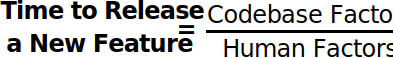
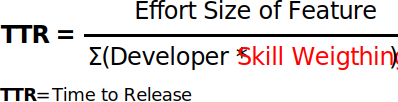
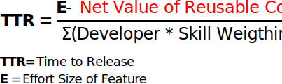
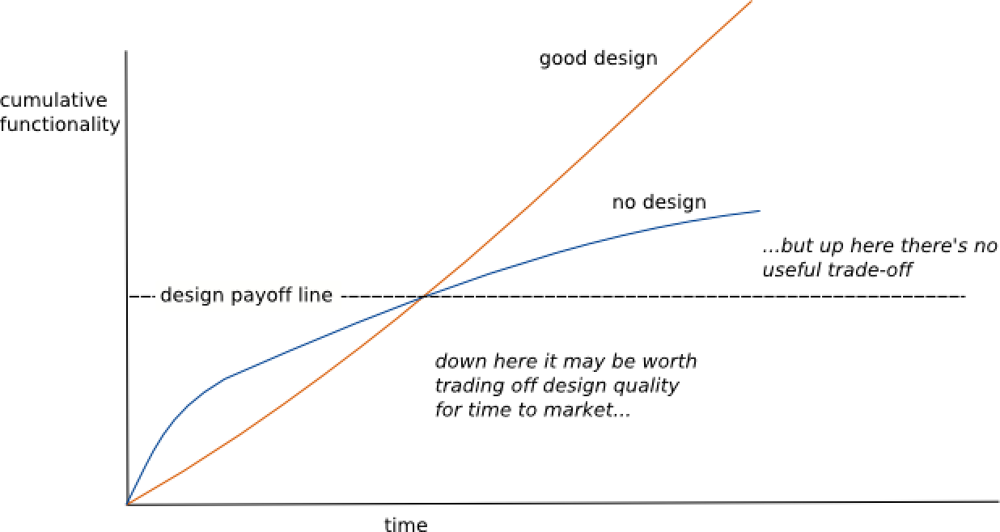
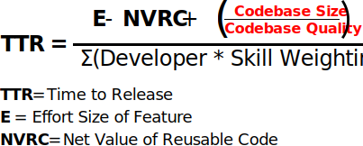
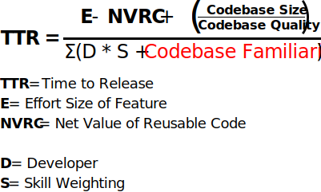
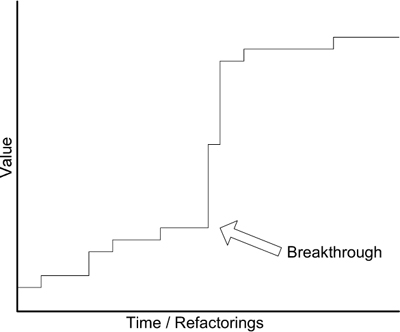
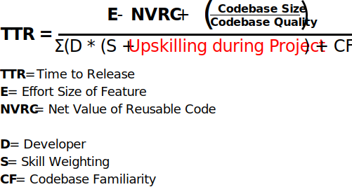
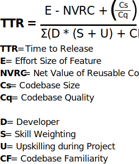

<blockquote>Enterprise asks of pair programming culture: Why would I pay two developers to do the job of one?</blockquote>

This concern with pair programming stems from the following notion about the nature of software feature release time:

Where number of developers is taken to mean <i>developers operating in parallel</i>.

If this equation were all there is to determining <b>Time-to-Release (TTR)</b> a new feature, then combining the efforts of two developers onto two tasks should effectively <i>double</i> the time it takes to complete those two tasks compared to the TTR if those developers were working in parallel, right?

But this is often not what we see in practice.

Frederick Brooks reframes the misconception eloquently in his classic software management anthology, [The Mythical Man-Month](https://www.amazon.com/Mythical-Man-Month-Software-Engineering-Anniversary/dp/0201835959/ref=sr_1_1?crid=3O2L8PDSPQDPI&keywords=the+mythical+man+month&qid=1580174025&sprefix=the+mythical+man+m%2Caps%2C140&sr=8-1):

<blockquote>...our estimating techniques fallaciously confuse effort with progress, hiding the assumption that [people] and months are interchangeable</blockquote>

To demonstrate how reality diverges from the above oversimplification, this article will progressively introduce human and codebase factors until we arrive at a more comprehensive TTR equation.

A sequel article, <b>Pair Programming in The Race to Release</b>, will demonstrate which factors of the TTR equation are affected positively and negatively by pair programming.

Our TTR equation will operate under the <i>ceteris paribus</i> assumption. We hold all other factors outside of software engineers, their skill and their interactions with each other as equal.

<h2>Codebase Divided by Humans</h2>

Before we get started adding more factors to the TTR equation, let's first observe the fact that one level of abstraction higher than the equation above, we arrive at:

The more complex the codebase factor, the higher the TTR.

The more maximized the human factor, the lower the TTR.

With this in mind, let's propose several codebase and human factors.

<h2>Technical Ability of Programmers</h2>

Not all programmers are of equal technical skill. Software development is composed of hundreds of small decisions every day. Experienced developers make better decisions quicker.

This skill difference can be reflected as each developer's skill weighting:

<i>NOTE: The sigma <b>Σ</b> just means "sum of all developers"</i>

The greater the technical ability, the fewer developers necessary to achieve the same TTR.

The mythical 10x engineer fits in here as a major factor, with a massive skill weighting.

<h2>Code Reuse</h2>

Good devs code well, but great devs know how to lift, adapt and integrate existing code into a new feature.

Reusable code can be integrated from one of two places:

- <b>1st Party</b>: This is code solving a similar though not necessarily identical problem to the one at hand. It can exist in the same codebase, or some other part of your organization (if properly modularized).
   
  <i class="example">Examples: Reusable UI components, in-house SDKs, closed-source libraries</i>

- <b>3rd Party</b>: SaaS and open-source packages

The decision to build from scratch versus integrating reusable code should be made in light of the estimated <i>net value of reusable code</i> (NVRC), where NVRC is:

<b>Net Value of Reusable Code = Custom Build Effort - Integration Effort</b>

If it takes more time and energy to integrate existing code than it would be to build from scratch, the net value becomes negative and lengthens TTR rather than shortening it.

Writing modularized and generic code suitable for reuse in new contexts requires additional effort compared to writing narrowly-scoped, problem-specific code.

But if your organization hopes to decrease TTR over the mid to long term, time ought to be allotted to modularize development in a manner that lowers the integration cost of key parts of your software product.

Let's subtract the net value of reusable code from the raw effort size of the feature.

<h2>Codebase Size Divided By Codebase Quality</h2>

<blockquote>Proper architecture allows codebases to grow in size without increasing in complexity.</blockquote>

[Martin Fowler](https://martinfowler.com/) calls the codebase superpower described above as <i>design stamina</i>, and plots it like so:

  

 

If you're codebase's intended lifespan stretches beyond a few weeks, you'll likely want to put proper design in the front seat of your development effort.

Good architecture is the difference between coding with duct tape and coding with cement.

As the codebase grows in size, the possibility for regressions caused by new features also grows, especially if it's design-less.

This is why greenfield projects often enjoy very high velocities early on: there are fewer constraints on each additional feature.

Though it's certainly a factor in TTR, Codebase Size cannot be considered as a TTR factor in isolation. What if the codebase were 1 million lines, but thanks to proper modularization, the new feature could effectively ignore all but a single integration point in that codebase.

Even in a monorepo as massive as [Google's](https://cacm.acm.org/magazines/2016/7/204032-why-google-stores-billions-of-lines-of-code-in-a-single-repository/fulltext), codebase size may not effect TTR significantly if the codebase quality is such that the place to add new modules is obvious and not interdependent.

The correlation between codebase size and TTR is meaningless without also taking codebase quality into consideration.

The greater the codebase quality, the less effect codebase size will have on TTR.

We reflect this by dividing codebase size by codebase quality, since quality offsets the negative effects of size. This quotient is added to the raw effort size of the feature:

<h2>Codebase Familiarity</h2>

Codebase familiarity is a human factor which encapsulates:

- <b>Tribal knowledge</b>: Tribal knowledge is peer-to-peer transmitted know-how which is non-obvious to out-members of a group. It is knowledge which is known, yet undocumented. 
  <i class="example">Example: “I remember what we named that method we need - let me just search for it”</i>
- <b>Architectural knowledge</b>: Mastery over the architectural paradigms scaffolding the codebase
   
  <i class="example">Example: “How should I implement navigation to this new screen? I should use the precedent set by the Coordinator pattern!”</i>

Codebase familiarity is a developer's timesaving ability to quickly discover the code they need to complete a task. It has little to do with skill and more to do with time spent in the trenches of a particular codebase.

Codebase familiarity arises from an interplay between the developer's memory and the codebase itself. They know it's quirks. They have the credentials they need. They know who wrote what.

Engineers with high codebase familiarity feel like they're walking into a toolshed they organized themselves. Only in software development, the analogy goes even further - because the engineer possibly also built the tools.

Even a great developer in uncharted territory may perform slower than a less skilled devevloper familiar with the ley of this land, however idiosyncratic it may be.

I think familiarity isn't quite as valuable as technical skill, so we add it rather than multiply it by the individual developer.

<h2>Upskilling Opportunities during Project</h2>

You are not the same developer at the end of a project as you were at the beginning.

I believe that skill development for software engineers does not grow linearly. Instead, it grows in a <i>step-wise</i> fashion. When a new concept is realized, be it from a mentor or a blog article, a developer's productivity may increase dramatically almost instantaneously. Hence the step-wise nature of development.

It's a bit like Eric Evans's description of the non-linear payoffs of good refactoring:

  

 

Upskilling is a kind of refactoring of the mind that yields new, previously unnoticed opportunities in development.

Assuming even the slightest modicum of motivation to improve is present, I believe the degree of developer growth is proportional to the quantity and diversity of upskilling opportunities presented to developers during a project.

Let's add Upskilling during Project to Skill Weighting to reflect the increase in skill programmers ought to undergo on a well managed project:

Upskilling during Project is where the 10x Engineer’s cool cousin, the Team Multiplier Engineer, acts as a major scaling factor.

<blockquote>A Team Multiplier Engineer is an individual who maximizes the effectiveness of existing team resources</blockquote>

Some devs just teach really well. They care that others know what they know. They multiply the lesser abilities of other engineers on the team with their positivity, kindness, and knack for succinct and comprehensible explanations of complex subject. Keep them around at all costs.

<h2>A More Realistic Time to Release Equation</h2>

In such a multivariate domain as feature release time, these factors are endlessly debatable and refineable.

Nonetheless, here’s a provisional definition which I take to be a more realistic equation for determining time to release a new feature:

The lead Software Engineer is responsible for leading a team to minimize the effect the codebase numerator of this equation.

Both the Product Manager and the lead Software Engineer are jointly responsible for maximizing the human denominator of this equation.

<h2>Next Week: Pair Programming in The Race to Release</h2>

With our TTR equation in tow, we're now better equipped to venture an answer to the manager's question that kicked off our exploration:

<blockquote>Why would I pay two developers to do the job of one?</blockquote>

Part II, <b>Pair Programming in The Race to Release</b>, will break down factor by factor how pairing can help or hurt your time to release.
